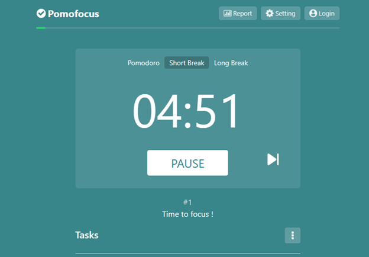
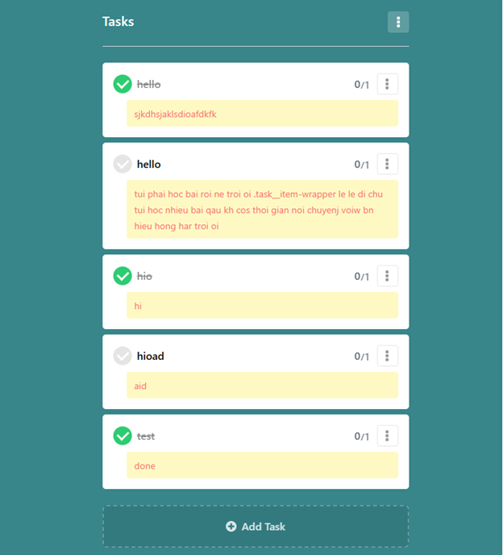
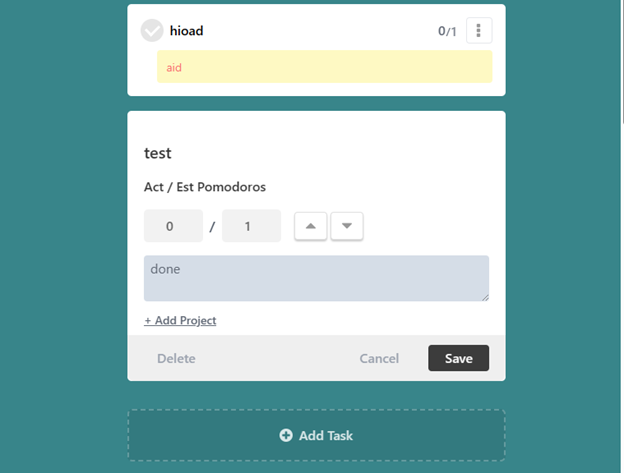
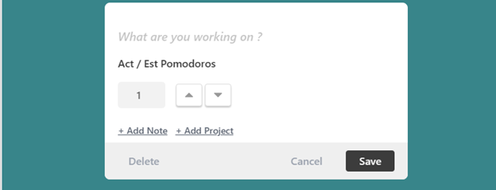

# :ballot_box_with_check: Pomodoro
:sweat_drops: I usually use Pomodoro to manage my time, so I decided to clone it from pomofocus.io and add some features that I want to have.

#### :pushpin: What is Pomodoro?
:sweat_drops: an application to help you focus on your work and study, also to remind you to take a break after a period of time and to help you manage your time and your tasks better.

#### :pushpin: Some features
- [x] Have 3 modes (Pomodoro, Short Break, Long Break)
+ Pomodoro: time to focus on your work (default is 25 minutes)
+ Short Break: time to take a short break (default 5 minutes)
+ Long Break: time to take a long break (default 15 minutes)
`Note:` You can change the time of each mode by clicking on Settings button on the top right corner and change them in the popup (section Timer).  

 

`Small feature:` When the countdown start, you can see the progress bar on the top , it will show you how much time left in the current mode.

- [x] Have a list of tasks that you want to do, you can add, edit, delete, check them as done or not done, `add notes` in that task, also you can see the number of tasks that you have done per total tasks you need to do in the left corner of each task.  

 

- [x] Pomos : number of pomos you have done / total pomos you need to do.
- [x] Finish at: estimate time when you finish all your tasks.

 

- [x] Box update task when you click on the setting button on the left corner of each task, you can change the name of the task, the number of pomos you need to do for that task, the priority of that task, the deadline of that task, and add notes for that task, like this:  

 

- [x] Add new task: you can add new task by clicking on the button `Add new task` on the bottom of list tasks.  

___
 

_other features will be updated later..._

